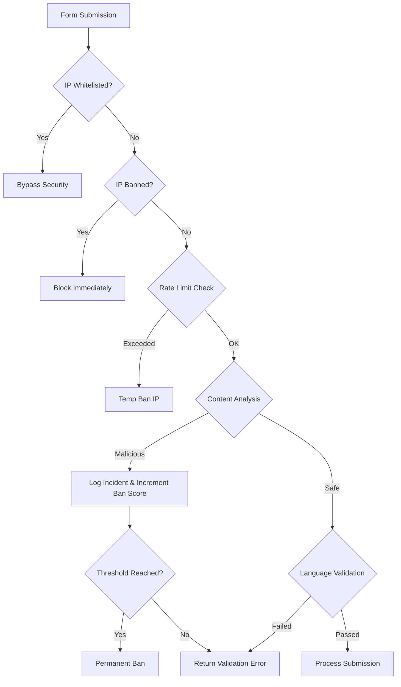

# Contact-Form-7-Spam-Checker (CF7FC)

**1st CF7 Form Checker** is a high-performance, multi-layered security extension for Contact Form 7. Designed for enterprise-grade protection, it combines behavioral analysis, network-level filtering, and content inspection to eliminate spam and malicious submissions with zero impact on legitimate users.

---

## 📋 Table of Contents

1. [**System Overview**](#1-system-overview)
   1.1 [Core Philosophy](#11-core-philosophy)
   1.2 [Key Features](#12-key-features)
2. [**User Documentation**](#2-user-documentation)
   2.1 [For Regular Users](#21-for-regular-users)
   2.2 [For Administrators](#22-for-administrators)
3. [**Technical Documentation**](#3-technical-documentation)
   3.1 [For Developers](#31-for-developers)
   3.2 [For Security Specialists](#32-for-security-specialists)
4. [**Logic & Architecture**](#4-logic--architecture)
   4.1 [Workflow Diagram](#41-workflow-diagram)
   4.2 [Validation Pipeline](#42-validation-pipeline)
5. [**Installation & Configuration**](#5-installation--configuration)
6. [**Maintenance & Troubleshooting**](#6-maintenance--troubleshooting)

---

## 1. System Overview

### 1.1 Core Philosophy
Developed by Senior PHP architects with 20+ years of experience, this plugin follows the "Security by Design" principle. Unlike traditional CAPTCHAs that degrade UX, CF7FC operates silently in the background, making autonomous decisions based on data-driven heuristics.

### 1.2 Key Features
*   **Zero-UI Protection:** No puzzles or checkboxes for users.
*   **Advanced IP Management:** Intelligent ban system with permanent escalation.
*   **Multi-Language Validation:** Regex-based character set validation for 20+ languages.
*   **Structural Content Analysis:** Detection of SQLi, XSS, and common bot patterns.
*   **JSON-Native Storage:** High-speed data operations without database overhead.

---

## 2. User Documentation

### 2.1 For Regular Users
As a website visitor, you will not notice the plugin's presence.
*   **Experience:** Just fill out the form as usual.
*   **Errors:** If your submission is blocked, you will see a standard CF7 validation error. This typically happens if you use forbidden characters or submit forms too rapidly.
*   **Privacy:** The system does not track your personal identity; it only analyzes the technical parameters of the submission for security purposes.

### 2.2 For Administrators
The plugin provides a powerful dashboard under **CF7 Security**.
*   **Dashboard:** Real-time statistics on blocked attacks and banned IPs.
*   **IP Management:** Manually whitelist trusted partners or permanently ban repeat offenders.
*   **Language Settings:** Restrict form submissions to specific languages (e.g., allow only English/Russian) to prevent international spam.
*   **Throttling:** Configure how many requests per minute a single IP can make.

---

## 3. Technical Documentation

### 3.1 For Developers
CF7FC is built as a final class `CF7_Advanced_Security` with a strict type system.
*   **Hooks:** Integrates with `wpcf7_validate_text` and `wpcf7_validate_email` at priority 10.
*   **Extensibility:** Designed for easy addition of new validation rules via the `validateField` method.
*   **Data Structure:** Settings and logs are stored in `wp-content/cf7fc_logs/` in JSON format.
*   **Code Quality:** PHP 7.4+ compatible, PSR-compliant structure, and `strict_types=1` enforcement.

### 3.2 For Security Specialists
*   **Defense Layers:**
    1.  **Rate Limiting:** Sliding window algorithm to prevent brute-force.
    2.  **IP Reputation:** Local ban list + whitelist bypass.
    3.  **Signature Matching:** Patterns for SQLi and XSS vectors.
    4.  **Behavioral:** Bot User-Agent detection.
*   **Audit Trail:** Every incident is logged with timestamp, IP, User-Agent, and attack payload (truncated).

---

## 4. Logic & Architecture

### 4.1 Workflow Diagram

### 4.2 Validation Pipeline
1.  **Pre-Validation:** Checks IP status and rate limits.
2.  **Structural Validation:** Checks field lengths and types.
3.  **Security Validation:** Scans for attack signatures.
4.  **Semantic Validation:** Character set and regex matching.

---

## 5. Installation & Configuration

1.  Upload the plugin directory to `/wp-content/plugins/`.
2.  Ensure `wp-content/cf7fc_logs/` is writable by the web server.
3.  Activate via WordPress Admin.
4.  Navigate to **CF7 Security > Settings** to enable specific protection modules.

---

## 6. Maintenance & Troubleshooting

*   **Logs Growth:** The system includes a log retention policy (default 30 days). Ensure your server has enough disk space.
*   **False Positives:** If legitimate users are blocked, check the **Security Dashboard** to see the reason and adjust language settings or whitelist the IP.
*   **CF7 Compatibility:** Requires Contact Form 7 v5.0 or higher.

---

*Developed by Paul Mann - Professional PHP Solutions 2026*
